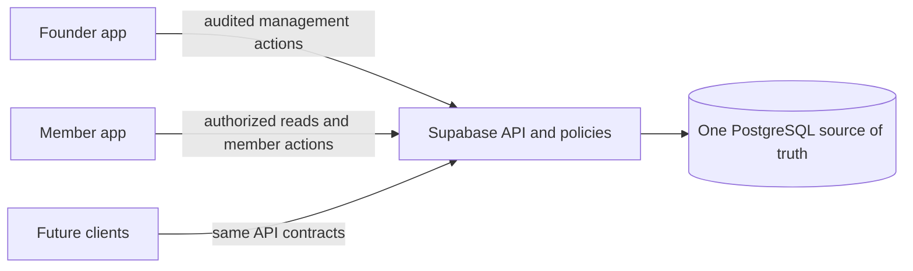

# TNHC Community roadmap

This roadmap follows four delivery stages. They are ordered by user value and
operational readiness; they are not release promises or calendar deadlines.
The feature register in [FEATURES.md](FEATURES.md) tracks individual work and
acceptance criteria.

## Current baseline

- Commit `0b602b4` added the curated catalogue; `5f0395f` added the shared
  Community directory and topic feed.
- The Supabase database is the source of truth for **32 Nexus projects, DevTrack,
  five public topics, and one sourced DevTrack release post**.
- Member and Founder are separate Android build variants of the same project.
  Common product behavior lives in shared code. Founder-only controls live in
  the Founder variant and are still authorized by the server.
- Shared catalogue and Community features are implemented in both variants:
  members can browse public topics and posts, join or leave topics, and publish
  text posts after the server confirms active membership. Founder tools can
  create topics, manage topic access and moderate content.
- Both debug variants are installed on the development phone. The remaining
  Stage 1 gate is end-to-end verification of shared data and authorization
  against the configured backend.

## Shared data and app synchronization

There is no separate Member database and no app-to-app replication service.
Founder controls write approved records to the shared Supabase backend, and the
Member app reads records its account is allowed to see. Future web, iOS, or
additional Android clients should use the same backend contracts. This keeps
content in one place while each client presents the controls appropriate to its
audience.

The sync acceptance test is concrete: change a project or publish a topic post
once through an authorized client, then confirm the other client sees that same
record after refresh. Do not copy content between APKs or maintain per-app
catalogues.

## Stage 1 — Finish the useful community experience

**Implemented:** members can browse public topics and posts, join or leave a
topic, and publish text after active-member authorization. Loading, empty,
error, and retry states are present. The Founder console can manage topics and
moderate content. The screen and content contracts are shared; each APK is a
separate client of the same Supabase data source.

**Next work:** verify the complete shared-data path against the configured
backend: update a controlled test topic from the Founder app, refresh the
Member app, and confirm the record appears once. Verify a member post appears
to the Founder, and check rejected inactive-member and non-Founder actions.
Use controlled test content and preserve the existing catalogue. Database
row-level security remains the authority for membership, visibility,
authorship, and Founder access.

**Exit gate:** the Community screen works end to end against the deployed
backend; Member and Founder observe the same authorized data; database and
Android tests cover allowed and denied actions; the feature register reflects
what was actually verified.

## Stage 2 — Run a safe, invite-only pilot

Use the working invitation flow to bring in a small group of trusted testers.
Verify invitation delivery, acceptance, password setup/recovery, sign-in,
profile editing, project follows, and account isolation with more than one
member account. Add member reporting and blocking, and a usable Founder
moderation queue before inviting beyond that closed group. Record moderation
actions and keep private conversations outside general Founder access.

**Exit gate:** invitations and account recovery work for real recipients;
members cannot access one another's private data; report, block, moderation,
and Founder authorization paths have end-to-end tests; the pilot has a support
contact and a process for handling abuse reports.

## Stage 3 — Make the service ready for a wider release

Complete account deletion and retention behavior, privacy and support
information, operational monitoring, rate limits, and a tested backup-and-
restore process using a backup stored away from the host. Confirm migration
and rollback procedures, production signing and versioning, installation on
representative Android devices, and a release checklist. Resolve critical
security, moderation, accessibility, or reliability defects before widening
access.

**Exit gate:** a clean-environment restore has been demonstrated; recovery,
deletion, and privacy behavior are documented and tested; there are no known
critical release blockers; signed release artifacts and rollback steps are
verified.

## Stage 4 — Expand from pilot evidence

Grow capabilities in this order, based on what members actually need:

1. **Organization profiles and directory:** distinct organization pages,
   membership/affiliation controls, and privacy-aware filters for people and
   organizations.
2. **Opportunities:** project roles, jobs, gigs, and services with clear owners,
   terms, status, and an enquiry route.
3. **One-to-one messaging:** private text conversations, blocking behavior,
   safe retries, and clear delivery state; add push and offline caching only
   with their privacy and reliability tests.

Each capability uses the same backend and permissions model. Sequence and scope
can change after pilot feedback; do not ship features only to match a version
number.

## Deferred until separately justified

Stories, group messaging, voice/video calling, marketplace transactions,
events, and automated matching remain unscheduled. Revisit them only after
community use demonstrates demand and the privacy, moderation, reliability,
maintenance, and cost requirements are understood. Payments and public access
require explicit product and operational decisions.

## Delivery principles

- Keep invite-only access until safety and moderation gates pass.
- Store shared product data once; keep Member and Founder differences in
  permissions and presentation, not duplicated records.
- Make additive database migrations and test server permissions independently
  of client visibility.
- Promote a feature only when its acceptance evidence is recorded in
  [FEATURES.md](FEATURES.md); a screen or schema alone is not completion.
- Do not promise dates. Adjust priorities with documented decisions and pilot
  evidence.
